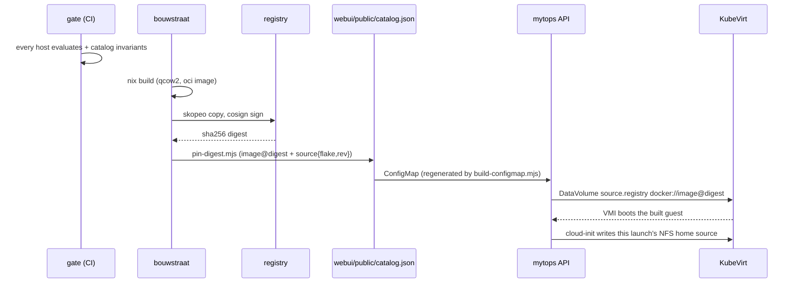

# Architecture

The bouwstraat is one flake that produces one image, plus the few rules that
turn "we built something" into "a user has a NixOS desktop".

## The three layers (and why there are three)

Borrowed from DAWO (its ADR-0001/0003), because the problem it solves is real:
the obligations that must hold everywhere and the choices that belong to one
organisation get tangled the moment they live in the same file.

1. **This flake** — the upstream core. Blocks, the two tiers, no branding, no
   user accounts, no app set.
2. **An org overlay** — a separate flake taking this one as an input. It adds
   the org's own blocks (identity, VPN, a VDI client, site settings) and its
   secrets. It never forks the core.
3. **A host** — `modules/hosts/vm-desktop.nix`. Chooses the tiers, the app set
   and the trade-offs, and is the only file that knows this image is a streamed
   desktop rather than an infrastructure box.

A consumer configures blocks through `mytops.<block>.enable` and
`mytops.<block>.options.*`. The body of every block lives in `mkIf cfg.enable`,
and a value that must not be weakened is set with `lib.mkForce` — a consumer can
change their mind about a setting, not about whether the control exists.

## The blocks

| Block | What it owns |
| --- | --- |
| `base.nix` | nix settings, hostname, time sources, the image identity file |
| `users.nix` | the desktop user (uid 1000, deliberately) and the break-glass admin |
| `cloud-init.nix` | the NoCloud seed the API writes, and `/run/mytops` as the hand-off point |
| `home.nix` | mounting the per-user home volume over `/home/<user>`, before anything draws a screen |
| `hardening.nix` | the rule register and `mytops-verify` |
| `desktop.nix` | the desktop environment and the app set |
| `stream.nix` | Xvfb → session → x11vnc → noVNC, on the port the API already expects |
| `image.nix` | GRUB, the root filesystem and `system.build.qcow2` |

`desktop.nix` and `stream.nix` are separate because they answer different
questions: what runs, and how it is reached. An infrastructure workspace sets
`mytops.stream.enable = false` and keeps a desktop, or the other way round - an
assertion refuses the combination that makes no sense (`environment = "none"`
with streaming on).

## The hardening register

Two axes, and the reason is worth stating once (DAWO ADR-0010 again):

```
level       ordered   none < baseline < hardened < strict
compliance  a set     bio, ncsc - norms that ask for specific rules
```

A norm is not "stricter": it asks for a *set* of rules, some in baseline and
some nowhere. Forcing that into an ordered scale produces a wrong answer to "is
compliance stricter than hardened". On top of the two axes:

- `excludeTags` vetoes rules by tag — the mechanism that lets a streamed desktop
  keep a control it structurally cannot have, without weakening the rules
  everyone else gets.
- `rules.<id> = true|false` wins over everything, because 19 of 20 rules must
  not require a fork.

Every rule declares a `check`, and `mytops-verify` runs them on the device with
three outcomes rather than two: `0` holds, `1` violated, `3` not evaluated (no
root, service not running, clock not synced yet). Collapsing "not evaluated"
into "holds" is how a report becomes a claim; collapsing it into "violated"
makes a fresh boot look broken.

## The image

One artifact, two packagings:

- `packages.x86_64-linux.qcow2` — `system.build.qcow2`, built with nixpkgs' own
  `make-disk-image` (no extra flake input; DAWO's zero-dependency instinct,
  applied to a build that only needs one artifact).
- `packages.x86_64-linux.ociImage` — the same disk inside a scratch container
  image, because CDI imports a *registry reference* and a store path is not
  something the cluster can pull. The catalog then pins the **digest** of that
  image, never its tag.

## How it reaches a workspace



The API side is deliberately small: `vmDiskSource(entry)` decides between a
registry import (a bouwstraat entry) and the public cloud image (the existing
`ubuntu-vm`), and `cloudInitUserData` splits into an Ubuntu guest that installs
its own desktop and a NixOS guest that only receives its home volume. The
Service, the IngressRoute, the readiness probe and the status derivation are
untouched — a NixOS workspace answers on 8080 like the others, which is why
`guestStreamReady` did not need to learn about it.

## What is not here

- **The container runtime.** Unchanged. Any image already works there; a NixOS
  container would need no code and would still sit inside the runtime's base,
  which is the opposite of the point.
- **Windows or a second guest OS.** The runtime is a string
  (`runtime: vm-nixos`), so a second one is a branch, not a redesign — but
  nothing claims to support one today.
- **A control plane.** Updates are a new digest in the catalog: a workspace is
  replaced on its next launch. Pushing updates into running workspaces is
  DAWO's comin/Sextant territory and a much larger decision.
